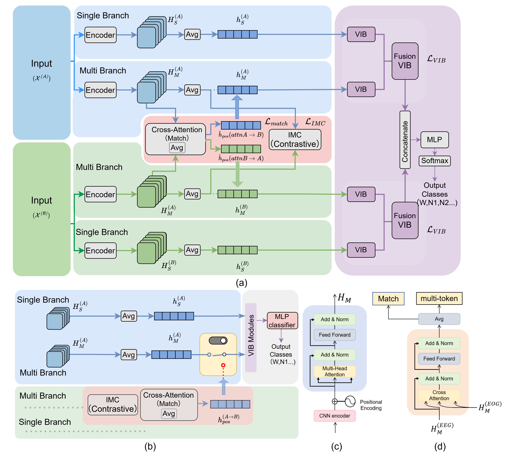

# M2U-DBMap

Official implementation of **M2U-DBMap**:  
**Multimodal-to-Unimodal Dual-Branch Mapping for Single-Modal Sleep Staging**.

M2U-DBMap is a cross-modal representation learning framework for automatic sleep staging. It learns from paired EEG-EOG polysomnography (PSG) data during training, while supporting practical single-modal inference with only EEG or only EOG at deployment.

This repository contains the training and model code for the M2U-DBMap project.

---

## Overview

Wearable and home sleep monitoring is often limited by sensing burden and channel availability. In many real-world scenarios, only a single modality, such as EEG or EOG, is available during deployment, although richer multimodal PSG data may be available during training.

M2U-DBMap addresses this training-inference discrepancy by learning cross-modal knowledge from paired EEG-EOG data and internalizing it into single-modal representations. Unlike reconstruction-based missing-modality methods, M2U-DBMap does not reconstruct missing EEG or EOG signals. Instead, it learns semantic cross-modal mappings in the feature space.

<p align="center">
  
</p>

---

## Highlights

- **Multimodal training, single-modal inference**  
  Learns from paired EEG-EOG data but supports EEG-only or EOG-only inference.

- **Dual-branch architecture**  
  Uses a modality-specific Single branch and a cross-modal Multi branch for each modality.

- **Cross-modal mapping without reconstruction**  
  Transfers multimodal semantics through representation-space alignment instead of generating missing signals.

- **Inter-Modal Contrastive learning and Cross-Modal Matching**  
  Aligns global EEG/EOG semantics and models sequence-level cross-modal correspondence.

- **Variational Information Bottleneck modules**  
  Suppresses redundant and nuisance information at both branch and fusion levels.

- **Lightweight single-modal adaptation**  
  Freezes the learned encoders and adapts only lightweight bottleneck/classification heads for deployment.

---

## Method

M2U-DBMap consists of two main stages.

### Stage 1: Multimodal Joint Training

During joint training, both EEG and EOG are available.

For each modality, the model builds two branches:

1. **Single branch**  
   Learns modality-specific discriminative features for sleep staging.

2. **Multi branch**  
   Learns cross-modal transferable features using:
   - Inter-Modal Contrastive learning (IMC);
   - Cross-Modal Matching with cross-attention;
   - Variational Information Bottleneck (VIB) regularization.

The Stage 1 model can be evaluated under full EEG+EOG multimodal inference.

### Stage 2: Single-Modal Transfer

After Stage 1, the encoders are frozen.

For EEG-only or EOG-only deployment, the model bypasses the cross-attention pathway and adapts only lightweight VIB modules and classifier heads using single-modal inputs from the original training split.

At test time, no auxiliary modality is used for single-modal inference.

---

## Repository Structure

```text
m2u-dbmap/
├── assets/                  # Framework figures
├── models/                  # Core model modules
├── split_idx/               # Dataset split indices
├── train_M2M.py             # Multimodal-to-multimodal training / evaluation
├── train_M2S.py             # Multimodal-to-single-modal transfer
├── train_S2S.py             # Single-modal-to-single-modal baseline training
├── train_SingleBranch.py    # Single/multi branch fine-tuning or evaluation entry
├── loader.py                # Data loading utilities
├── transform.py             # Signal and data transformations
├── utils.py                 # Utility functions
├── requirements.txt         # Python dependencies
└── README.md
```

---

## Installation

Create a Python environment:

```bash
conda create -n m2u-dbmap python=3.9
conda activate m2u-dbmap
```

Install dependencies:

```bash
pip install -r requirements.txt
```

The code is implemented with PyTorch.

---

## Dataset Preparation

Prepare raw or preprocessed datasets locally before training.

The method is designed for sleep staging datasets with paired EEG and EOG signals. In the paper, experiments are conducted on:

- Sleep-EDF-78;
- ISRUC-Sleep Subgroup I;
- HMC.

A typical preprocessing pipeline should include:

1. segmenting PSG recordings into 30-second epochs;
2. mapping labels to five sleep stages:
   - W;
   - N1;
   - N2;
   - N3;
   - REM;
3. removing movement or unknown epochs;
4. resampling EEG and EOG signals to 100 Hz if needed;
5. preparing subject-independent train/validation/test splits;
6. saving data in the format expected by `loader.py`.

A possible directory layout is:

```text
data/
├── SleepEDF/
│   ├── processed/
│   └── split_idx/
├── ISRUC/
│   ├── processed/
│   └── split_idx/
└── HMC/
    ├── processed/
    └── split_idx/
```

The exact paths should be specified in the config JSON file passed through `--config`.

---

## Training and Evaluation

### 1. Multimodal-to-Multimodal Training

Use this mode when both EEG and EOG are available for training and inference.

```bash
python train_M2M.py --config path/to/config.json --gpu 0
```

This corresponds to Stage 1 multimodal joint training.

---

### 2. Multimodal-to-Single-Modal Transfer

Use this mode to derive EEG-only or EOG-only inference heads after multimodal training.

```bash
python train_M2S.py --config path/to/config.json --gpu 0
```

This corresponds to Stage 2 single-modal transfer.

---

### 3. Single-Modal Baseline Training

Use this mode to train a single-modal baseline from scratch.

```bash
python train_S2S.py --config path/to/config.json --gpu 0
```

This is useful for comparing standard EEG-only or EOG-only training against the proposed multimodal-to-unimodal transfer setting.

---

### 4. Single Branch Fine-Tuning / Evaluation

```bash
python train_SingleBranch.py --config path/to/config.json --gpu 0
```

This entry can be used for single-branch or multi-branch fine-tuning and evaluation, depending on the config settings.

---

## Configuration

Training is controlled by a JSON config file passed through `--config`.

A config file should specify:

- dataset name;
- dataset root path;
- split index path;
- selected modality or modalities;
- model hyperparameters;
- training hyperparameters;
- checkpoint directory;
- logging directory;
- evaluation settings.

Example:

```bash
python train_M2M.py --config configs/sleepedf_m2m.json --gpu 0
```

Create config files according to your local dataset paths and training settings.

---

## Experimental Settings

The paper evaluates M2U-DBMap under three inference settings:

| Setting | Training Input | Test Input | Description |
|---|---|---|---|
| EEG+EOG | EEG+EOG | EEG+EOG | Full multimodal inference |
| EEG only | EEG+EOG, then EEG-only adaptation | EEG | Single-modal EEG deployment |
| EOG only | EEG+EOG, then EOG-only adaptation | EOG | Single-modal EOG deployment |

Evaluation metrics include:

- Accuracy;
- Macro-F1;
- Cohen's kappa;
- per-class F1 scores for W, N1, N2, N3, and REM.

---

## Main Results

The following table summarizes the main results reported in the paper.

| Dataset | Inference Setting | ACC | MF1 | Kappa |
|---|---:|---:|---:|---:|
| Sleep-EDF-78 | EEG+EOG | 85.3 | 80.2 | 0.797 |
| Sleep-EDF-78 | EEG only | 84.8 | 79.8 | 0.790 |
| Sleep-EDF-78 | EOG only | 81.7 | 75.2 | 0.746 |
| ISRUC-Sleep Subgroup I | EEG+EOG | 82.7 | 81.2 | 0.776 |
| ISRUC-Sleep Subgroup I | EEG only | 81.9 | 80.2 | 0.766 |
| ISRUC-Sleep Subgroup I | EOG only | 79.8 | 78.4 | 0.739 |
| HMC | EEG+EOG | 81.5 | 79.0 | 0.756 |
| HMC | EEG only | 80.8 | 78.2 | 0.746 |
| HMC | EOG only | 78.9 | 76.3 | 0.721 |

> Results may vary depending on preprocessing, data splits, implementation details, and hardware environment.

---

## Reproducibility Notes

Before running experiments, please make sure that:

- dataset files follow the expected format used by `loader.py`;
- split index files under `split_idx/` match the dataset and fold setting;
- config paths match your local file system;
- EEG and EOG channel settings are consistent with your preprocessing pipeline;
- checkpoint and log directories exist or can be created automatically.

---

## Citation

If you find this repository useful, please consider citing our work:

```bibtex
@article{cai2026m2udbmap,
  title   = {Internalizing Multimodal Knowledge for Single-Modal Sleep Staging via Decoupled Dual-Branch Cross-Modal Mapping},
  author  = {Cai, Yongxin and Jiang, Boxuan and Ren, Haoran and Dai, Chenyun and Guo, Yao},
  journal = {TBD},
  year    = {2026}
}
```

Please update the BibTeX entry after the paper is formally published.

---

## License

This project is released under the MIT License.

If you use this code, please also respect the licenses and usage terms of the corresponding public sleep datasets.

---

## Acknowledgements

This work uses public PSG datasets for sleep staging research. We thank the dataset maintainers and the open-source community for providing valuable resources for automatic sleep analysis.
